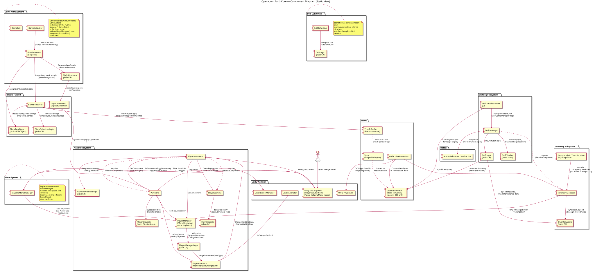
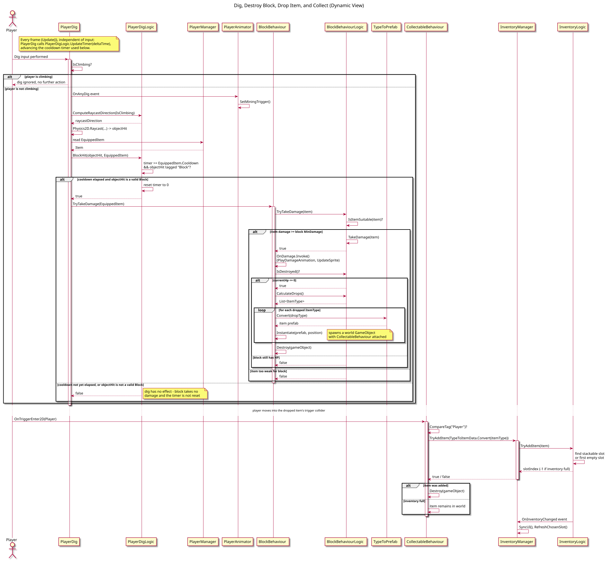
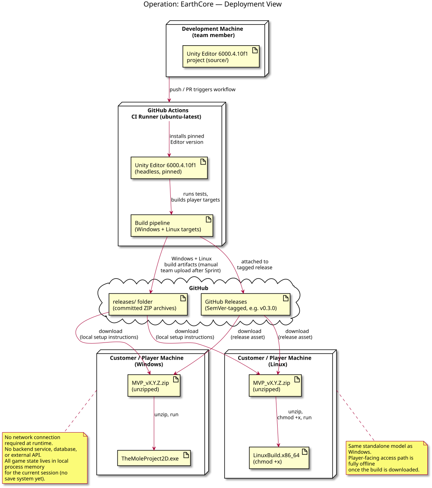

# Architecture

This document is the canonical maintained architecture index for **Operation: EarthCore**. It describes the current delivered architecture using three views — static, dynamic, and deployment — and links the Architecture Decision Records (ADRs) that explain why key structural choices were made.

Maintained architecture view sources live under:

- [`docs/architecture/static-view/`](static-view/) — component diagram source (PlantUML)
- [`docs/architecture/dynamic-view/`](dynamic-view/) — sequence diagram source (PlantUML)
- [`docs/architecture/deployment-view/`](deployment-view/) — deployment diagram source (PlantUML)
- [`docs/architecture/adr/`](adr/) — Architecture Decision Records

All diagrams are maintained as diagrams-as-code using **PlantUML**. Source `.puml` files are committed alongside their rendered `.svg` output so the architecture stays both versioned and directly readable without requiring a local renderer.

---

## Static View

Source: [`static-view/component-diagram.puml`](static-view/component-diagram.puml)

### What the diagram shows

The component diagram groups the codebase into subsystems, all running inside the Unity Editor/Player runtime — there is no backend, database, or external API:

- **Game Management** — `GameInitializer`, `GridGenerator`, and `GameExit` are co-located on a single `"Game Manager"` `GameObject` in the `Level` scene. `GridGenerator` is a singleton that delegates procedural world generation to `WorldGenerator` (a plain C# class handling terrain, layers, and deposit generation) and then instantiates block/background prefabs directly under its own `transform`.
- **Menu System** — `InGameMenuManager` replaced the earlier `PauseManager` and now handles both pausing and inventory toggling through a single `Toggle(GameObject)` state machine, driven by the `InGameMenu` action map (`TogglePause`, `ToggleInventory`). Its exact `GameObject` placement in the scene hierarchy has not been directly confirmed.
- **Player Subsystem** — `PlayerMovement` and `PlayerDig` are attached to the player `GameObject` (`PlayerDig` requires `PlayerMovement`, and `PlayerMovement` in turn requires `PlayerStamina`, both via Unity's `[RequireComponent]`). `PlayerAnimator` is a `MonoBehaviour` singleton (static `Instance`, assigned in `Awake()` — the same pattern `GridGenerator` uses); `PlayerDigLogic` is a plain C# singleton. `PlayerManager` is **not** a singleton — despite an earlier documentation pass assuming it was — it is a plain `MonoBehaviour` reached via `GetComponent<PlayerManager>()` (same `GameObject`) or a `"Player"` tag lookup (cross-`GameObject`, used by `InGameMenuManager` and `ToggleUI`). `PlayerMovement`, `PlayerDig`, `PlayerManager`, and `PlayerStamina` each delegate their rules to a plain C# companion (`PlayerMovementLogic`, `PlayerDigLogic`, `PlayerManagerLogic`, `StaminaLogic`) — all four logic classes have no `UnityEngine` scene dependency.
- **Blocks / World** — `BlockBehaviour` (`MonoBehaviour`) delegates all damage/HP/drop-table logic to `BlockBehaviourLogic` (plain C#), and reads its stats from a `BlockTypeData` `ScriptableObject`. `WorldGenerator` reads `LayerDefinition`/`DepositDefinition` data to decide what each grid cell contains before `GridGenerator` renders it.
- **Items** — `Item` `ScriptableObject` assets are the single source of truth for item stats. `TypeToItemData` and `TypeToPrefab` are static converters that resolve an `ItemType` enum value to its `Item` asset or world prefab via `Resources.Load` — `TypeToItemData`'s converter only registers types with a numeric value of 100 or above, which is a real, load-bearing constraint on which items can be looked up this way.
- **Inventory Subsystem** — `InventoryManager` (`MonoBehaviour`, holds Unity references and input bindings) delegates all slot/stacking logic to `InventoryLogic` (plain C#, no Unity dependency). UI (`InventorySlot`, `InventoryItem`) locates `InventoryManager` via a `"Game Manager"` tag lookup, not a direct reference or singleton.
- **Crafting Subsystem** — `CraftManager` requires `InventoryManager` on the same `GameObject` and delegates recipe validation and material spending to `CraftLogic`, which operates directly on `InventoryLogic`. `CraftManager` also consults the static `CraftTracker` class to check whether a tool has already been crafted (each successful craft is tracked for the lifetime of the running process, with no reset mechanism) and to gate progressive-tool prerequisites.
- **Hotbar** — `HotbarBehaviour`/`HotbarSlot` receive equipped-instrument changes from `CraftManager`.
- **Drill Subsystem** — `DrillBehaviour` and `DrillLogic` follow the same wrapper/logic split as the rest of the codebase, identified via the coverage report and naming convention; their internal structure was not directly explored during this documentation pass.

External dependencies are limited to the Unity Engine platform itself: the Input System (action-based input, now with separate `Player` and `InGameMenu` action maps), Physics2D (raycasting for digging, trigger colliders for item pickup), the Animator, and the Scene Manager. The product interacts with exactly one external "actor" — the player — and no network services.

### Coupling, cohesion, and maintainability

- **Logic/MonoBehaviour separation is the dominant pattern** and is the codebase's strongest maintainability asset: `BlockBehaviourLogic`, `InventoryLogic`, `CraftLogic`, `StaminaLogic`, `PlayerDigLogic`, `PlayerMovementLogic`, and `PlayerManagerLogic` contain the actual game rules as plain C# classes with no `UnityEngine` scene dependencies. Per the real coverage report, `BlockBehaviourLogic`, `CraftLogic`, `StaminaLogic`, and `PlayerManagerLogic` each reach **100%** line coverage, and `InventoryLogic` reaches **83.9%** — these classes are unit-tested in isolation without loading a scene. The `MonoBehaviour` wrapper classes stay comparatively thin, though their own coverage is consistently lower than their logic classes' (`BlockBehaviour` 39.7% vs. `BlockBehaviourLogic` 100%; `PlayerMovement` 48.5% vs. `PlayerMovementLogic` 50%), since wrappers still depend on live input, physics, or scene wiring that the split does not remove — see [ADR-003](adr/ADR-003-separate-logic-classes-from-monobehaviour-wrappers.md) for the full breakdown.
- **Cohesion is high within each subsystem** — each package groups a `MonoBehaviour`, its logic class, and its data (`ScriptableObject`) together, and each has a single clear responsibility (block state, inventory state, crafting rules, stamina state).
- **Coupling risk: singletons.** `PlayerAnimator` is a `MonoBehaviour` singleton; `PlayerDigLogic` is a plain C# singleton. Both are reached via static access rather than dependency injection. This keeps wiring simple for a small Unity team but means these classes are implicitly global state — any subsystem can reach into them, which makes their lifecycle and mutation points harder to trace as the codebase grows. `PlayerManager` is a related but distinct case: it's reached via `GetComponent`/tag lookup, not a static singleton — an earlier documentation pass incorrectly grouped it with the singletons above, corrected after checking the real `PlayerManager.cs` directly rather than trusting `static-analysis/UnityStubs.cs`'s mirror of it (which declared a `static Instance` field that does not exist on the real class). This tradeoff, and the corrected distinction between the singleton and non-singleton access styles, is recorded in [ADR-002](adr/ADR-002-singleton-access-for-cross-cutting-player-state.md).
- **Coupling risk: `GameObject.FindWithTag("Game Manager")`.** UI classes (`InventoryItem`, `InventorySlot`, `CraftPanelRenderer`) locate `InventoryManager`/`CraftManager` via a hardcoded tag lookup rather than a reference passed in or a singleton. This works because there is exactly one `"Game Manager"` object per scene, but it is a runtime-only, string-based coupling that the compiler cannot verify — a typo or missing tag fails silently or only at runtime.
- **Static, unreset state: `CraftTracker`.** Once a tool type is successfully crafted, `CraftTracker.IsCrafted()` returns `true` for the rest of the running process, with no public reset method. This is a real testability constraint we hit directly while writing `CraftingIntegrationTests`: a test that successfully crafts a tool makes that same craft impossible to test again without restarting the Editor/test process.
- **Known gap: `Time.timeScale` is not actively enforced on scene load.** `GameInitializer.Start()` is empty — nothing there resets `Time.timeScale`. The only places that explicitly set it to `1` are `SceneLoader` (on scene transitions) and `InGameMenuManager.ResumeGame()`. QR-003's guarantee currently holds only when the `Level` scene is entered via `SceneLoader`, not when loaded directly — a distinction that matters for both real gameplay (main menu → level) and for how `QRT-003` is written.
- **Which quality requirements the structure supports or constrains:** the Logic/MonoBehaviour split directly supports **QR-002 (fault tolerance)** — `BlockBehaviourLogic` can be exercised with a null-data edge case in a PlayMode test without a full scene setup, which is exactly how [QRT-002](../quality-requirement-tests.md#qrt-002) is implemented. It also supports **Testability** as a maintainability concern more broadly. The tag-based lookup pattern and the `Time.timeScale` gap above are both constraints on **QR-003 (operability)**: if the `"Game Manager"` tag were ever renamed or duplicated, or if the `Level` scene were ever loaded through a path other than `SceneLoader`, dependent systems could fail with no compile-time warning.

---

## Dynamic View

Source: [`dynamic-view/dig-pickup-sequence.puml`](dynamic-view/dig-pickup-sequence.puml)

### What scenario the diagram represents

The diagram traces the core gameplay loop end to end: the player attempts to dig, the attempt is gated by a per-item cooldown timer and a climbing-state check, a valid hit applies damage and potentially destroys the block, a resource item drops into the world, and the player collects it into their inventory. This spans two separate runtime triggers (a dig input event, then later a physics trigger event when the player walks into the dropped item) and ten components across four subsystems (Player, Blocks/World, Items, Inventory).

**Corrected from an earlier version of this diagram**, after being asked to double-check it against the current source rather than assume it was still accurate: the earlier version omitted two real behaviors confirmed in `PlayerDig.cs` and `PlayerDigLogic.cs` — (1) digging is a no-op entirely while the player is climbing (`if (_playerMovement.IsClimbing) return;`), and (2) `BlockHit()` is not a simple "is this a valid block" check — it gates every dig attempt behind a per-item cooldown timer (`_timer >= EquippedItem.Cooldown`), incremented every frame via `PlayerDigLogic.UpdateTimer()`. The earlier diagram read `EquippedItem` *after* a successful `BlockHit()`; in reality it's read *before*, since the item's `Cooldown` value is itself an input to the check.

### Why this scenario is important to the product

This is the single most-executed interaction loop in the game — every resource the player ever obtains passes through this exact path (`PlayerDig` → `BlockBehaviour` → `BlockBehaviourLogic` → `TypeToPrefab` → `CollectableBehaviour` → `InventoryManager` → `InventoryLogic`). If any link in this chain breaks, the entire game becomes unplayable, which is why `QR-002` specifically targets `BlockBehaviour`'s fault tolerance.

### What it helps the reader reason about

- **Tool-dependent dig speed is a real mechanic, not just a cosmetic cooldown.** Because `BlockHit()` compares the elapsed timer against the *equipped item's* `Cooldown` field, different tools genuinely dig at different rates — this is gameplay-relevant balancing logic living inside what looks like a simple validity check, and is easy to miss without tracing the actual method signature.
- **Integration boundary between "world" and "inventory":** items only enter the inventory system through `CollectableBehaviour.OnTriggerEnter2D`, which is a physics-driven boundary, not a direct method call from `BlockBehaviour`. This means a dropped item is genuinely a separate world entity for a period of time — it has its own `GameObject`, can be missed by the player, and is not guaranteed to be picked up.
- **Where fault tolerance actually lives:** `BlockBehaviourLogic.IsItemSuitable` gates whether damage is applied at all, and `InventoryLogic.TryAddItem` returns `-1`/`false` rather than throwing when the inventory is full — the diagram shows both of these as explicit `alt` branches rather than assumed-successful paths, which is directly what `QRT-002` verifies for the block side.
- **Why `PlayerAnimator` exists as a singleton, and why `PlayerManager` doesn't:** the diagram shows `PlayerAnimator` reacting to `PlayerDig`'s `OnAnyDig` event via its static `Instance`, while `PlayerManager` is read for the currently equipped item via a `GetComponent` reference obtained in `PlayerDig.Awake()` — a `MonoBehaviour` reached by component lookup, not a singleton. Both achieve the same goal (state reachable without threading a reference through every call in the chain) via different mechanisms; the distinction and the correction behind it are recorded in [ADR-002](adr/ADR-002-singleton-access-for-cross-cutting-player-state.md).

---

## Deployment View

Source: [`deployment-view/deployment-diagram.puml`](deployment-view/deployment-diagram.puml)

### What the diagram shows

Operation: EarthCore is built and distributed as a **standalone offline executable** — there is no server component. A team member's local Unity Editor (pinned to **6000.4.10f1**, matching [`docs/development-process.md`](../development-process.md)) is where development happens; GitHub Actions CI installs the identical pinned Editor version headlessly to run tests and produce Windows and Linux player builds. Build artifacts are placed in the repository's `releases/` folder and attached to SemVer-tagged GitHub Releases. Customers and TAs download a platform-specific ZIP, extract it, and run `TheMoleProject2D.exe` (Windows) or `LinuxBuild.x86_64` (Linux, after `chmod +x`) — this is the customer-facing access path documented in the root `README.md`'s local setup instructions. This view is unaffected by Sprint 5's gameplay/test changes and remains accurate.

### Why this deployment model was chosen

A standalone build was the natural choice for a Unity 2D single-player game with no multiplayer, persistence-across-devices, or server-authoritative requirement — there is no gameplay reason to require a network connection or hosted backend. This keeps the deployment surface minimal: no infrastructure to provision, secure, or pay for, which matters for a student team with no operations capacity.

### How the current deployment supports or constrains the product

**Supports:** zero runtime network dependency means the game works identically for every customer regardless of connectivity, and there are no server costs, uptime concerns, or backend security surface to manage — consistent with the "no runtime secrets" configuration-management approach in `docs/development-process.md`.

**Constrains:** there is currently no save system, which is a direct consequence of having no persistent storage layer beyond the local session — anything like cloud saves, leaderboards, or cross-device play would require introducing a new deployment component (local file I/O at minimum, a backend at most) that does not exist today. Distribution is also fully manual: builds are uploaded to `releases/` and GitHub Releases by hand after each Sprint rather than through an automated continuous-delivery pipeline, as documented in `docs/development-process.md`'s CI Process section.

### What must be considered when deploying or operating it for the customer

Because there is no auto-update mechanism, customers must be told which specific version ZIP to download each Sprint (the release notes and Week N report links serve this purpose). OS-specific instructions (unzip method, `chmod +x` on Linux) must stay accurate in the root `README.md`'s local setup instructions, since there is no installer to handle this automatically.

---

## Architecture Decisions

The following ADRs record the key architectural decisions behind the structure shown above. See [`docs/architecture/adr/`](adr/) for the full set.

| ADR | Decision | Quality requirement(s) addressed |
|---|---|---|
| [ADR-001](adr/ADR-001-unity-as-the-game-engine.md) | Use Unity as the game engine | QR-001 (time behaviour) |
| [ADR-002](adr/ADR-002-singleton-access-for-cross-cutting-player-state.md) | Use singleton access (`MonoBehaviour` singleton for `PlayerAnimator`, plain C# for `PlayerDigLogic`) for cross-cutting player state; `PlayerManager` uses a different, non-singleton mechanism | QR-003 (operability) |
| [ADR-003](adr/ADR-003-separate-logic-classes-from-monobehaviour-wrappers.md) | Separate game-rule logic classes from `MonoBehaviour` wrapper classes | QR-002 (fault tolerance) |

Each ADR links back to the specific quality requirement(s) it addresses in [`docs/quality-requirements.md`](../quality-requirements.md), and each affected quality requirement links back to its ADR — see the "Linked ADRs" field on QR-001, QR-002, and QR-003.