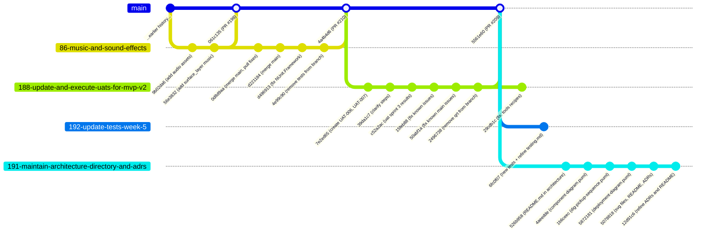

# Development Process

This document describes how the Operation EarthCore team develops, reviews, tests, and releases the product, and how the project's configuration is managed. It is a maintained project asset: it must be kept current whenever the branching strategy, CI pipeline, release process, or configuration approach changes.

See [Process Requirements](../Process_Requirements.md) for the shared Scrum, Work Status, Definition of Done, and traceability semantics this process implements, and Product Repository Requirements for the underlying repository mechanics and enforcement rules.

## Git Workflow

The team uses a short-lived feature-branch workflow off a single protected default branch (`main`). Every change is tied to an issue, developed on its own branch, opened as a pull request, reviewed by a teammate, and merged back into `main` with a merge commit. Releases are tagged directly on `main`.

### What the diagram shows

The diagram shows `main` as the single protected default branch. Reading top to bottom:

- **PR #198** (`061c135`) merged `86-music-and-sound-effects` for the first time - this passed its own PR-time CI. **PR #210** (`4a4b4d6`) merged the *same branch a second time* after it was reopened to fix a problem that only surfaced on `main` after the first merge: a stray `using NUnit.Framework;` import that broke `StaticAnalysis.csproj` builds (fixed in `d496913`, "fix issues with NUnit.Framework"). See the note on this below.
- **PR #209** (`5561e60`, the current tip of `origin/main`) merged `188-update-and-execute-uats-for-mvp-v2` - six commits creating and executing `UAT-006`/`UAT-007` and fixing issues found along the way. This branch was **reused after merging** (`29cdb1c`, "fix: tools recipes") for a follow-up fix, the same pattern seen in earlier `maintain-root` reuse.
- **`192-update-tests-week-5`** (merged) - the full Sprint 5 test-suite rewrite and `docs/testing.md` refresh (`6fc0f07`).
- **`191-maintain-architecture-directory-and-adrs`** (merged) - the architecture views, ADRs, and README work (`526b958` through `12d91c6`).

### How the team actually uses this workflow

- **Branch naming mostly follows `<issue-number>-short-description`** (e.g. `188-update-and-execute-uats-for-mvp-v2`, `191-maintain-architecture-directory-and-adrs`, `192-update-tests-week-5`, `86-music-and-sound-effects`), matching the convention required by `docs/definition-of-done.md`. **Branch reuse after merging for genuinely new work is a real, recurring pattern:** `188-update-and-execute-uats-for-mvp-v2` gained a commit (`29cdb1c`) after its PR (#209) merged, and `maintain-root` was merged via two separate PRs.
- **`86-music-and-sound-effects` was merged twice (PR #198, then PR #210) not because of reused-branch convenience, but because the first merge passed its own PR-time CI checks yet still introduced a problem once on `main`** - specifically the stray `using NUnit.Framework;` import that later caused the `StaticAnalysis.csproj` build failures worked through earlier in this project's history (commit `d496913`, "fix issues with NUnit.Framework", is part of the follow-up PR #210). This points to a real gap: **a PR passing CI against its own branch does not guarantee `main` stays green after merging**, if the branch was out of date with `main` or if some CI job behaves differently on a direct push to `main` versus a pull request. Worth a team decision: require branches to be up to date with `main` before merge (or use a merge queue), and confirm CI runs identically on both PR and post-merge triggers.
- **One issue, one branch, one PR** for product and Sprint work: a PBI's implementation evidence is its own linked PR, or - for a complex User Story split into supporting PBIs - the combined evidence of its supporting PBIs' PRs.
- **No squash or rebase merges**: all PRs are merged into `main` using a merge commit (visible as the `Merge pull request #NNN from coolcamilla/<branch>` commits in the real history above). This preserves full commit history per issue and keeps the merge commit itself usable as Definition-of-Done evidence.
- **Required review**: every PR requires approval from at least one team member other than the author before it can be merged. Self-approval is not permitted.
- **CI must pass before merge**: branch protection on `main` requires the full CI pipeline (linting, EditMode/PlayMode tests, automated Quality Requirement Tests, Roslyn static analysis, and Lychee link checking) to pass on the PR before it is mergeable.
- **Tagging releases**: once a Sprint's scope is merged into `main`, the team creates an annotated SemVer tag (`vX.Y.Z`) on the resulting commit and publishes a GitHub Release mapped to the corresponding `MVP` version.

## How Issues Are Created and Used

- PBIs originate from Product Backlog refinement - either new work identified during Sprint Planning, customer feedback from a Sprint Review, or a bug/gap discovered during implementation of other work.
- Every issue is created with, at minimum, the following fields (visible consistently across the team's real issues referenced throughout this project's history, e.g. `#167`, `#178`, `#188`, `#191`, `#192`):
  - **Priority** (Must / Should / Could / Won't)
  - **`MVP Version`** the PBI targets
  - **Story Points** estimate
  - **Assignee** (implementer)
  - **Reviewer** (must differ from the assignee)
  - **Work Status** (see the table below)
  - **Acceptance Criteria** - a checklist the PBI must satisfy before it can move to `Done`
- An issue is used as the single source of truth for a PBI's scope and status throughout its lifecycle: its Work Status field is updated as work progresses, its linked PR is where implementation evidence lives, and it is closed only once Definition of Done criteria are met (see Code Review Process, step 5, below).
- **Known limitation, stated honestly:** this section describes the fields consistently observed across real issues in this project rather than a verified copy of the actual `.github/ISSUE_TEMPLATE` file content - if the team's real issue template differs in structure, this section should be corrected to match it exactly rather than the other way around.

## Product Backlog and Sprint Backlog Management

The team manages the Product Backlog and Sprint Backlog using **GitHub Projects** views on the [Team32 project board](https://github.com/users/coolcamilla/projects/2):

- **Product Backlog view** - shows all open PBIs (issues), ordered by priority.
- **Sprint Backlog view** - filtered to the current Sprint milestone, grouped by Work Status, showing priority, `MVP Version`, Story Points, assignee, and status per item.
- **MVP filtered view** - filters the backlog by `MVP Version` label so the scope for a given MVP increment is inspectable independent of which Sprint it lands in.

Each Sprint has a corresponding GitHub Milestone (e.g. Sprint 1, Sprint 2, Sprint 3) containing the Sprint number, start/end dates, the Sprint Goal, and the selected Sprint scope. All PBIs selected for a Sprint are assigned to that Sprint's milestone, which is what makes the Sprint Backlog view in GitHub Projects show only that Sprint's items when filtered.

## Workflow States and Entry Criteria

Every PBI (issue) moves through the following Work Status values, defined in [`docs/definition-of-done.md`](definition-of-done.md):

| Status | Entry criteria |
| --- | --- |
| `To Do` | PBI exists in the Product Backlog; not yet selected for a Sprint. |
| `Ready` | Selected for the current Sprint, assigned to an implementer, estimated in Story Points, has clear acceptance criteria, and is assigned to the Sprint milestone. Can be started. |
| `In Progress` | A branch has been created for the issue and work has started. |
| `Review` | A PR/MR is open, linked to the issue, and ready for another team member to review. |
| `Done` | All applicable [Definition of Done](definition-of-done.md) criteria are satisfied: acceptance criteria met, reviewed and approved by someone other than the author, all CI checks passing, relevant tests/QRTs passing, `CHANGELOG.md` updated if user-visible, merged into `main` via merge commit, and the issue closed and linked to its implementation evidence. |

These states are tracked directly on each issue (via label or a Work Status field, depending on the issue template) and reflected in the GitHub Projects board columns described above, so the Sprint Backlog view can be grouped by Work Status.

## Reproducible Development Environment

- The project is a standard Unity project pinned to **Unity Editor 6000.4.10f1**; `ProjectSettings/` is committed to the repository so the Editor version, player settings, and input action assets are identical across all team members' machines and in CI.
- New contributors set up the environment by installing **Unity Hub**, then installing **Unity Editor 6000.4.10f1** (matching `ProjectSettings/ProjectVersion.txt`), and opening the project from the repository root.
- The CI pipeline installs the same pinned Unity Editor version in a clean GitHub Actions runner for every build and test run, so CI results are reproducible independent of any individual developer's local Editor installation or OS.
- IDE-specific configuration (Rider, Visual Studio) is not committed; each contributor uses their preferred C# IDE pointed at the Unity-generated project files.
- There is currently no Nix flake, `devenv` configuration, or containerized setup for this project, since Unity Editor installation itself is not containerizable in a way that's practical for this course. Unity Hub + the pinned Editor version is the team's reproducibility mechanism.

## CI Process

The CI pipeline runs via GitHub Actions on every pull request targeting `main` and on every push to `main`, using **Unity Editor 6000.4.10f1** (matching the pinned local development version). It is not currently configured for continuous deployment - release builds (Windows/Linux zips) are produced and attached to GitHub Releases manually by the team after a Sprint's scope is merged, rather than automatically on every `main` push. The pipeline enforces, in order:

1. Roslyn `NetAnalyzers` static analysis (the additional QA check) on pure C# model/logic classes.
2. Unity Test Runner: EditMode unit tests, PlayMode integration tests, and automated Quality Requirement Tests (QRTs).
3. Code coverage measurement and report generation (OpenCover + ReportGenerator).
4. Lychee link checking across maintained documentation.

All four must pass on the latest protected-branch run before a PBI can be marked `Done`, per [`docs/definition-of-done.md`](definition-of-done.md).

## Code Review Process

1. A PBI moves to `Review` Work Status once its PR is opened and linked to the issue.
2. The PR description documents what was implemented, how it was tested (automated and/or manual), and which Quality Requirements or QRTs it satisfies, per the team's [PR/MR template](../.github/pull_request_template.md).
3. A reviewer who did not author the change reviews the diff, checks out the branch if manual verification in the Unity Editor is needed, checks the acceptance criteria, and either approves or requests changes.
4. All required CI checks must be green before merge is allowed; branch protection on `main` blocks merging otherwise.
5. The author or reviewer merges the PR using a merge commit and closes the linked issue, moving its Work Status to `Done`.

## Release Process

1. Once all Sprint PBIs targeted for the current `MVP` version are merged into `main` and CI is green on the latest commit, the team creates a SemVer tag prefixed with `v` (e.g. `v0.3.0`) on that commit.
2. A GitHub Release is published from the tag. The release description identifies the `MVP` version and Sprint it maps to, links the Sprint milestone, run/access instructions, the public sanitized demo video, and the corresponding Week N public report.
3. `CHANGELOG.md` is updated under the new version heading, consolidating the `[Unreleased]` entries added by individual PRs during the Sprint.
4. Build artifacts (Windows/Linux zip archives) are attached to the release and/or placed in the `releases/` folder in the repository.

## Configuration Management

Operation EarthCore is a Unity client-only game with no backend service, so configuration management here means keeping build-relevant settings reproducible and keeping no secrets in the repository, rather than managing deployed-service environments.

- **No runtime secrets or credentials.** The game has no backend, API keys, or third-party service credentials. Nothing in the configuration baseline needs to be excluded from CI logs or environment variables for security reasons.
- **Unity project settings are version-controlled.** `ProjectSettings/` (including the pinned Unity Editor version **6000.4.10f1**, player settings, and input action assets) is committed to the repository so every team member and the CI pipeline build against an identical configuration.
- **Generated and local-only files are excluded** via `.gitignore` (`Library/`, `Temp/`, `Obj/`, `Build/`, `Logs/`, `UserSettings/`, IDE-specific files). These are machine-specific or regenerable and must never be committed.
- **Build configuration lives in CI, not local machines.** The GitHub Actions workflow installs the pinned Unity Editor version and builds Windows/Linux targets headlessly, so release builds are reproducible from the repository state alone rather than from a developer's local Editor install.
- **Static analysis configuration** (`static-analysis/StaticAnalysis.csproj`, Roslyn `NetAnalyzers` rule set) is committed alongside the source it analyzes, so the additional QA gate is versioned together with the code it checks. **Known maintenance risk, confirmed by two separate real incidents:** `StaticAnalysis.csproj` uses `EnableDefaultCompileItems=false` and an explicit `<Compile Include>` list rather than a glob pattern. This list must be updated by hand whenever a logic-class file is renamed, moved, or deleted. This has caused real problems twice: commit `b4d6aa1` ("fix: remove deleted scripts from Static Analysis", branch `148-climbing-animation`, PR #195) and, later, a stale reference to a deleted `PauseLogic.cs` (removed when the pause system was replaced by `InGameMenuManager`) that caused a CI build failure (`CS2001: Source file ... could not be found`). Two independent occurrences make this a systemic risk worth addressing directly (e.g. a pre-commit check or CI step that verifies every `<Compile Include>` path still exists) rather than something to keep fixing reactively. See `docs/testing.md`'s Additional QA Check Rationale table for the same note from the testing-status side.
- **No large binaries or build output are committed to Git history**, per the team Definition of Done; only source assets, project configuration, and small reference images are tracked.
- **Changes to configuration are reviewed like any other change.** Edits to `ProjectSettings/`, CI workflow files, or `.gitignore` go through the same branch -> PR -> review -> merge process as product code.

## Quality Gates That Must Remain Active

The CI pipeline enforces, on every PR and on every push to `main`:

- EditMode unit tests and PlayMode integration tests (Unity Test Runner)
- Automated Quality Requirement Tests (QRT-001 through QRT-003 and any added later)
- Roslyn `NetAnalyzers` static analysis (the additional QA check)
- Lychee link checking
- Minimum 30% line coverage on critical modules (`InventoryManager`, `CraftManager`, `GridGenerator`, and any module added to that list)

These gates are maintained project assets established in Assignment 4. They must not be disabled or weakened without an explicit team decision documented in [`docs/definition-of-done.md`](definition-of-done.md).
